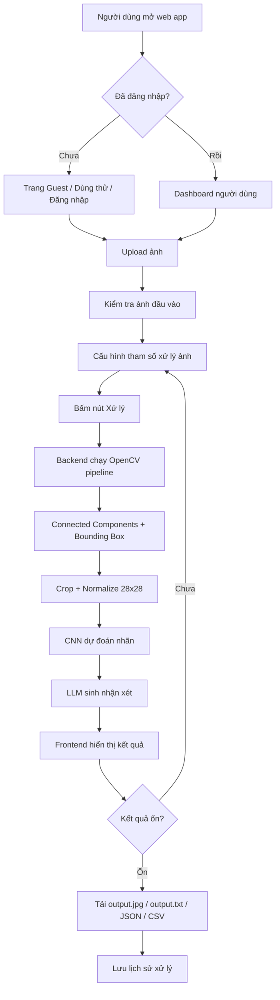
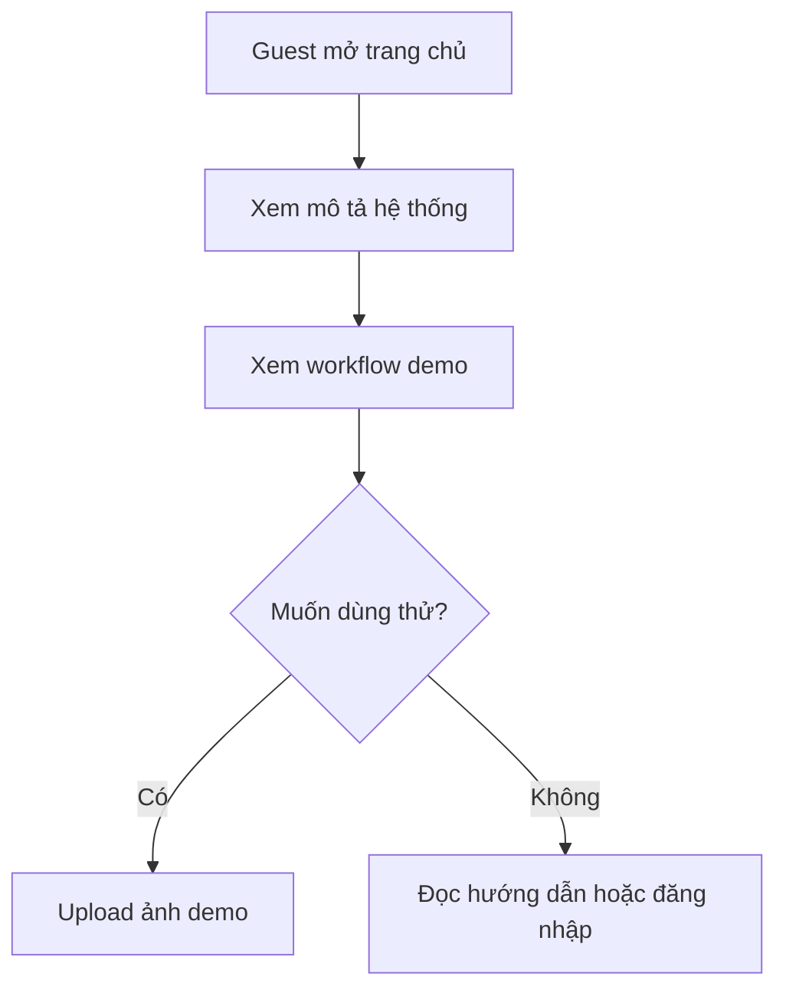
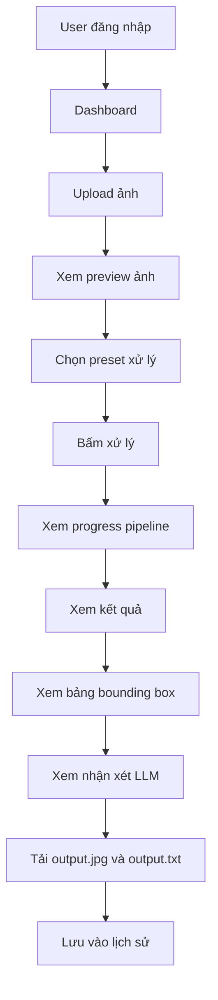
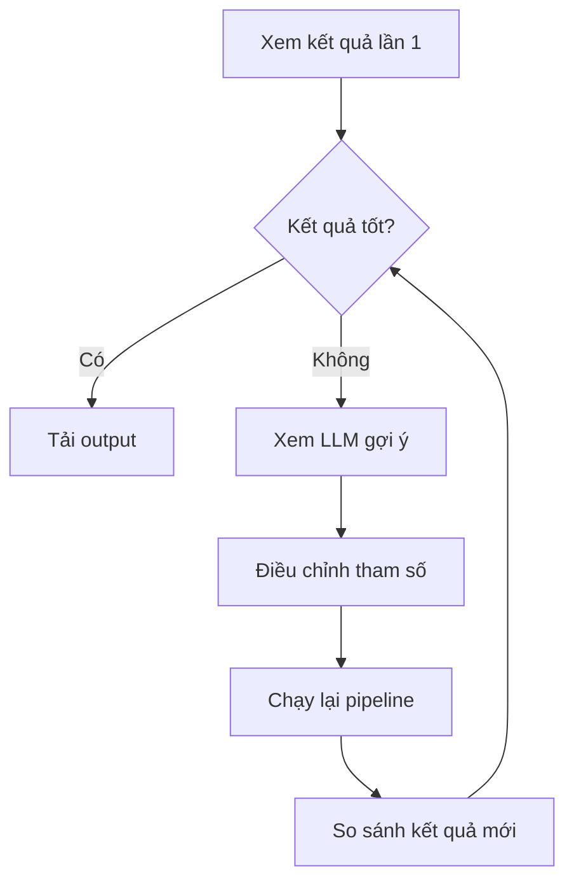
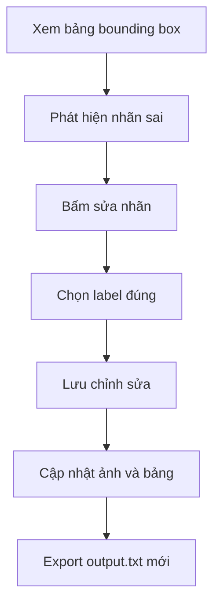
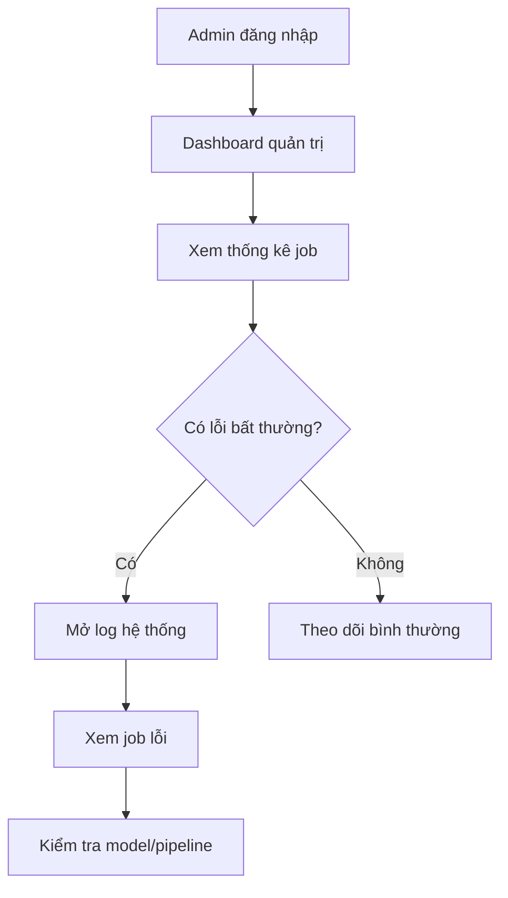
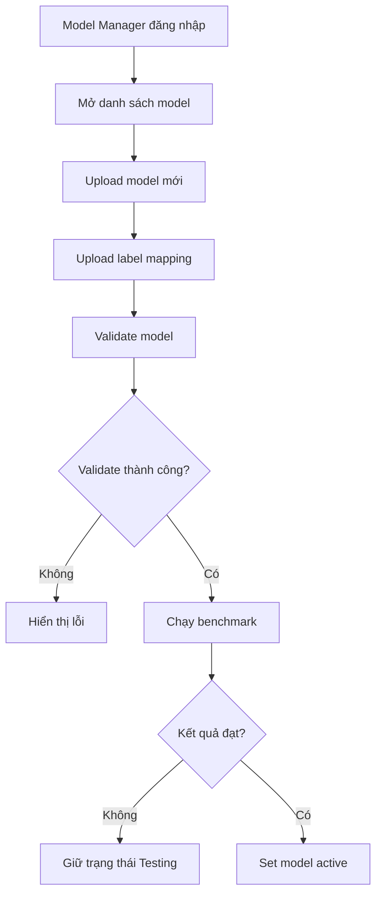

# ĐẶC TẢ NỘI DUNG UI THEO ROLE  
## Noisy Digit and Character Detection and Recognition System

> **Tên hệ thống:** Nhận diện chữ số và chữ cái trong ảnh nhiễu bằng xử lý ảnh, bounding box và CNN  
> **Mục tiêu tài liệu:** Mô tả chi tiết các giao diện cần làm, thông tin cần hiển thị trên từng UI, role cần có và workflow UI theo từng role.  
> **Ngôn ngữ:** Tiếng Việt có dấu  
> **Phạm vi:** Frontend web app + màn hình quản trị + màn hình kỹ thuật cho mô hình AI/CNN/LLM.

---

## 1. Tóm tắt yêu cầu hệ thống từ mô tả project

Hệ thống cho phép người dùng upload ảnh chứa chữ số hoặc chữ cái màu đen trên nền trắng. Ảnh có thể bị nhiễu, nền bẩn, đứt nét, mờ nét, ký tự không đều hoặc có các vùng đen không phải ký tự. Sau khi upload, backend chạy pipeline xử lý ảnh bằng OpenCV, tìm connected components, lọc bounding box, crop ký tự, chuẩn hóa về kích thước 28x28 và đưa vào mô hình CNN để nhận diện nhãn.

Kết quả hệ thống cần trả về:

- Ảnh kết quả có bounding box màu đỏ quanh từng ký tự.
- File `output.txt` chứa tọa độ bounding box và nhãn dự đoán.
- Bảng kết quả gồm tọa độ, kích thước, nhãn dự đoán và độ tin cậy.
- Các ảnh trung gian như grayscale, binary threshold, noise removal, morphology result, connected components.
- Nhận xét tự động từ LLM về chất lượng ảnh, mức nhiễu, lỗi nghi ngờ và gợi ý chỉnh tham số.
- Chức năng chỉnh tham số xử lý ảnh như threshold mode, kernel size, dilation iterations, min area.

---

## 2. Các role cần có trong hệ thống

### 2.1. Role tối thiểu nên làm

Nếu làm project theo phạm vi vừa đủ để demo tốt, nên có **3 role chính**:

| Role | Tên tiếng Việt | Mục đích | Có bắt buộc không? |
|---|---|---|---|
| `GUEST` | Khách truy cập | Xem giới thiệu, dùng thử upload ảnh nếu hệ thống cho phép | Không bắt buộc, nhưng nên có |
| `USER` | Người dùng xử lý ảnh | Upload ảnh, chạy nhận diện, xem kết quả, chỉnh tham số, tải file | Bắt buộc |
| `ADMIN` | Quản trị viên | Quản lý người dùng, lịch sử xử lý, cấu hình hệ thống, model, log lỗi | Bắt buộc nếu có đăng nhập |

### 2.2. Role mở rộng nếu muốn làm đầy đủ hơn

Nếu muốn project rõ phần AI/CNN/LLM hơn, có thể tách thêm role kỹ thuật:

| Role | Tên tiếng Việt | Mục đích | Ghi chú |
|---|---|---|---|
| `MODEL_MANAGER` | Quản lý mô hình AI | Upload model CNN, xem accuracy, confusion matrix, chọn model active, kiểm thử model | Có thể gộp vào `ADMIN` nếu project nhỏ |
| `REVIEWER` | Người kiểm tra kết quả | Xem kết quả nhận diện, sửa nhãn thủ công, đánh dấu lỗi, tạo dữ liệu để cải thiện model | Phù hợp nếu muốn có chức năng human-in-the-loop |

### 2.3. Khuyến nghị chọn role để triển khai

Để vừa đủ chi tiết nhưng không quá nặng, nên triển khai theo cách sau:

- **Bản cơ bản:** `USER` + `ADMIN`.
- **Bản demo đẹp:** `GUEST` + `USER` + `ADMIN`.
- **Bản đầy đủ cho đề tài AI:** `GUEST` + `USER` + `ADMIN` + `MODEL_MANAGER`.

Trong thực tế code, có thể gộp `ADMIN` và `MODEL_MANAGER` vào một tài khoản admin để giảm độ phức tạp backend.

---

## 3. Ma trận quyền theo role

| Chức năng | Guest | User | Admin | Model Manager |
|---|---:|---:|---:|---:|
| Xem trang giới thiệu hệ thống | Có | Có | Có | Có |
| Upload ảnh dùng thử | Có, nếu bật demo | Có | Có | Có |
| Chạy nhận diện ký tự | Có giới hạn | Có | Có | Có |
| Chỉnh tham số xử lý ảnh | Có giới hạn | Có | Có | Có |
| Xem ảnh trung gian của pipeline | Có | Có | Có | Có |
| Xem bảng bounding box | Có | Có | Có | Có |
| Tải `output.jpg` | Có giới hạn | Có | Có | Có |
| Tải `output.txt` | Có giới hạn | Có | Có | Có |
| Xem nhận xét LLM | Có giới hạn | Có | Có | Có |
| Lưu lịch sử xử lý | Không | Có | Có | Có |
| Xem lịch sử cá nhân | Không | Có | Có | Có |
| Xem tất cả lịch sử xử lý | Không | Không | Có | Có nếu được cấp quyền |
| Quản lý user | Không | Không | Có | Không |
| Xem log lỗi backend | Không | Không | Có | Có |
| Upload model CNN mới | Không | Không | Có nếu gộp role | Có |
| Chọn model active | Không | Không | Có nếu gộp role | Có |
| Xem benchmark model | Không | Không | Có | Có |
| Quản lý preset tham số | Không | Không | Có | Có |

---

## 4. Cấu trúc menu tổng quát

### 4.1. Menu cho Guest

- Trang chủ
- Giới thiệu hệ thống
- Dùng thử nhận diện
- Hướng dẫn sử dụng
- Đăng nhập / Đăng ký

### 4.2. Menu cho User

- Dashboard cá nhân
- Upload và xử lý ảnh
- Lịch sử xử lý
- Chi tiết kết quả
- So sánh lần chạy, nếu có
- Hồ sơ cá nhân
- Hướng dẫn sử dụng

### 4.3. Menu cho Admin

- Dashboard quản trị
- Quản lý người dùng
- Quản lý lịch sử xử lý
- Quản lý cấu hình pipeline
- Quản lý preset tham số
- Quản lý model CNN
- Quản lý LLM explanation
- Log hệ thống
- Cấu hình hệ thống

### 4.4. Menu cho Model Manager

- Dashboard mô hình
- Danh sách model CNN
- Upload model mới
- Kiểm thử model
- Benchmark / Evaluation
- Confusion matrix
- Dataset test
- Cấu hình class label

---

## 5. Workflow UI tổng quát của hệ thống



---

## 6. Danh sách UI cần làm theo mức độ ưu tiên

### 6.1. UI bắt buộc

| STT | Tên UI | Role dùng | Mục tiêu |
|---:|---|---|---|
| 1 | Trang chủ / Landing page | Guest, User | Giới thiệu hệ thống, mô tả nhanh workflow |
| 2 | Đăng nhập / Đăng ký | Guest | Xác thực user |
| 3 | Dashboard người dùng | User | Xem thống kê cá nhân và truy cập nhanh chức năng upload |
| 4 | Upload ảnh | User | Chọn ảnh đầu vào và kiểm tra ảnh |
| 5 | Cấu hình tham số xử lý | User | Chọn threshold, kernel, dilation, min area |
| 6 | Màn hình đang xử lý | User | Hiển thị trạng thái pipeline |
| 7 | Chi tiết kết quả nhận diện | User | Hiển thị ảnh kết quả, bounding box, nhãn và confidence |
| 8 | Bảng bounding box | User | Xem tọa độ, kích thước, nhãn, confidence |
| 9 | Panel ảnh trung gian | User | Xem grayscale, binary, morphology, connected components |
| 10 | Panel nhận xét LLM | User | Xem cảnh báo và gợi ý cải thiện |
| 11 | Export kết quả | User | Tải `output.jpg`, `output.txt`, CSV/JSON |
| 12 | Lịch sử xử lý | User | Xem lại các lần upload và kết quả |
| 13 | Dashboard admin | Admin | Tổng quan hệ thống |
| 14 | Quản lý lịch sử xử lý | Admin | Theo dõi job, lỗi, kết quả |
| 15 | Quản lý model CNN | Admin / Model Manager | Chọn model active, xem thông số model |
| 16 | Log hệ thống | Admin | Xem lỗi backend/API/model |

### 6.2. UI nên có nếu muốn demo chuyên nghiệp

| STT | Tên UI | Role dùng | Mục tiêu |
|---:|---|---|---|
| 1 | So sánh lần chạy | User | So sánh kết quả khi đổi tham số |
| 2 | Chỉnh sửa nhãn thủ công | User / Reviewer | Sửa label sai và export lại file |
| 3 | Preset tham số | User / Admin | Lưu cấu hình xử lý cho ảnh nhiễu nhẹ/nặng |
| 4 | Benchmark model | Model Manager | Đánh giá accuracy và confusion matrix |
| 5 | Quản lý prompt LLM | Admin | Chỉnh template sinh nhận xét |
| 6 | Trang hướng dẫn | Guest / User | Hướng dẫn định dạng ảnh, tham số, lỗi thường gặp |

---

# PHẦN A - UI CHO GUEST

---

## 7. UI 01 - Trang chủ / Landing Page

### 7.1. Mục tiêu

Trang chủ giúp người dùng hiểu hệ thống làm gì, đầu vào là gì, đầu ra là gì và cách sử dụng cơ bản.

### 7.2. Role truy cập

- Guest
- User
- Admin
- Model Manager

### 7.3. Thông tin cần hiển thị

#### Khu vực hero

- Tên hệ thống: `Noisy Digit and Character Detection and Recognition System`.
- Mô tả ngắn: `Hệ thống nhận diện chữ số và chữ cái trong ảnh nhiễu bằng OpenCV, Bounding Box và CNN`.
- Nút chính:
  - `Dùng thử ngay`
  - `Đăng nhập`
  - `Xem hướng dẫn`

#### Khu vực mô tả bài toán

Cần hiển thị ngắn gọn:

- Input: ảnh chứa nhiều chữ số/chữ cái màu đen trên nền trắng.
- Ảnh có thể bị nhiễu, nền bẩn, đứt nét, mờ nét.
- Output: ảnh có bounding box, file output.txt, bảng tọa độ, label, confidence.

#### Khu vực workflow trực quan

Hiển thị 5 bước:

1. Upload ảnh.
2. Làm sạch ảnh bằng OpenCV.
3. Tìm bounding box bằng connected components.
4. Nhận diện ký tự bằng CNN.
5. Xuất kết quả và nhận xét LLM.

#### Khu vực công nghệ

- OpenCV
- NumPy
- CNN TensorFlow/Keras hoặc PyTorch
- FastAPI hoặc Flask
- React/Vue/HTML CSS JS
- LLM API

### 7.4. Action cần có

| Action | Mô tả |
|---|---|
| Bấm `Dùng thử ngay` | Chuyển sang UI upload demo |
| Bấm `Đăng nhập` | Chuyển sang trang login |
| Bấm `Xem hướng dẫn` | Chuyển sang trang hướng dẫn |

### 7.5. Gợi ý layout

- Header trên cùng: logo, menu, nút đăng nhập.
- Hero section ở giữa.
- 3 card mô tả: `Input`, `Processing`, `Output`.
- Section workflow dạng timeline.
- Section demo ảnh trước/sau.

---

## 8. UI 02 - Đăng nhập / Đăng ký

### 8.1. Mục tiêu

Cho phép người dùng đăng nhập để lưu lịch sử xử lý, tải lại kết quả cũ và dùng đầy đủ chức năng.

### 8.2. Role truy cập

- Guest

### 8.3. Thông tin form đăng nhập

| Field | Kiểu dữ liệu | Bắt buộc | Ghi chú |
|---|---|---:|---|
| Email | Text/email | Có | Dùng làm username |
| Mật khẩu | Password | Có | Tối thiểu 6 ký tự |
| Ghi nhớ đăng nhập | Checkbox | Không | Lưu session/token |

### 8.4. Thông tin form đăng ký

| Field | Kiểu dữ liệu | Bắt buộc | Ghi chú |
|---|---|---:|---|
| Họ tên | Text | Có | Tên hiển thị |
| Email | Text/email | Có | Không trùng user khác |
| Mật khẩu | Password | Có | Tối thiểu 6 ký tự |
| Xác nhận mật khẩu | Password | Có | Phải khớp mật khẩu |
| Vai trò | Hidden/default | Có | Mặc định là `USER` |

### 8.5. Action cần có

- Đăng nhập.
- Đăng ký.
- Quên mật khẩu, nếu có thời gian làm.
- Quay lại trang chủ.

### 8.6. Validate lỗi cần hiển thị

- Email không hợp lệ.
- Email hoặc mật khẩu sai.
- Tài khoản bị khóa.
- Mật khẩu xác nhận không khớp.
- Server lỗi, vui lòng thử lại.

---

# PHẦN B - UI CHO USER

---

## 9. UI 03 - Dashboard người dùng

### 9.1. Mục tiêu

Dashboard là màn hình đầu tiên sau khi user đăng nhập. Màn hình này giúp user xem nhanh lịch sử, số lần xử lý ảnh, kết quả gần nhất và nút upload ảnh mới.

### 9.2. Role truy cập

- User
- Admin
- Model Manager, nếu cần test nhanh pipeline

### 9.3. Thông tin cần hiển thị

#### Card thống kê cá nhân

| Card | Ý nghĩa |
|---|---|
| Tổng ảnh đã xử lý | Số lần user đã upload và chạy pipeline |
| Số job thành công | Số lần xử lý thành công |
| Số job lỗi | Số lần backend/model lỗi |
| Confidence trung bình | Trung bình confidence của các lần xử lý gần đây |
| Ảnh xử lý gần nhất | Thời gian lần xử lý mới nhất |

#### Khu vực hành động nhanh

- Nút `Upload ảnh mới`.
- Nút `Xem lịch sử`.
- Nút `Xem hướng dẫn chọn ảnh đầu vào`.

#### Bảng kết quả gần đây

| Cột | Mô tả |
|---|---|
| Thời gian | Ngày giờ upload |
| Tên file | Tên ảnh đầu vào |
| Số ký tự phát hiện | Tổng số bounding box hợp lệ |
| Confidence TB | Độ tin cậy trung bình |
| Trạng thái | Thành công / Lỗi / Đang xử lý |
| Action | Xem chi tiết / Tải kết quả / Xóa |

### 9.4. Action cần có

- Upload ảnh mới.
- Mở chi tiết kết quả gần đây.
- Tải nhanh `output.jpg` hoặc `output.txt`.
- Xóa một lịch sử xử lý của chính user, nếu cho phép.

### 9.5. Trạng thái UI

- Chưa có lịch sử: hiển thị empty state `Bạn chưa xử lý ảnh nào. Hãy upload ảnh đầu tiên.`
- Có job đang xử lý: hiển thị badge `Đang xử lý` và thanh progress.
- Có lỗi gần đây: hiển thị cảnh báo nhẹ.

---

## 10. UI 04 - Upload ảnh

### 10.1. Mục tiêu

Cho phép user chọn ảnh đầu vào, kiểm tra định dạng, xem preview và xác nhận upload.

### 10.2. Role truy cập

- User
- Admin
- Guest, nếu bật dùng thử

### 10.3. Thông tin cần hiển thị

#### Khu vực upload

- Drag & drop file ảnh.
- Nút `Chọn ảnh từ máy`.
- Gợi ý định dạng: `JPG`, `JPEG`, `PNG`.
- Gợi ý chất lượng ảnh:
  - Ký tự nên là màu đen hoặc tối.
  - Nền nên là trắng hoặc sáng.
  - Ảnh không nên quá mờ.
  - Ký tự không nên dính quá sát nhau.

#### Preview ảnh

Sau khi chọn file cần hiển thị:

| Thông tin | Mô tả |
|---|---|
| Tên file | Ví dụ `sample_digits.png` |
| Kích thước file | Ví dụ `512 KB` |
| Độ phân giải | Ví dụ `1024 x 512 px` |
| Định dạng | PNG/JPG |
| Trạng thái đọc ảnh | Hợp lệ / Không hợp lệ |

### 10.4. Validate ảnh đầu vào

| Điều kiện | Xử lý UI |
|---|---|
| File không phải ảnh | Báo lỗi `File không đúng định dạng ảnh` |
| File quá lớn | Báo lỗi `Dung lượng ảnh vượt quá giới hạn` |
| Ảnh quá nhỏ | Cảnh báo `Ảnh quá nhỏ, kết quả có thể không chính xác` |
| Ảnh không đọc được | Báo lỗi `Không thể đọc ảnh` |
| Ảnh nền quá tối | Cảnh báo `Nền ảnh có thể không phù hợp` |

### 10.5. Action cần có

- `Chọn ảnh`
- `Xóa ảnh đã chọn`
- `Tiếp tục cấu hình`
- `Xử lý nhanh với cấu hình mặc định`

### 10.6. Gợi ý layout

- Bên trái: khu vực upload và hướng dẫn.
- Bên phải: preview ảnh và thông tin file.
- Dưới cùng: nút tiếp tục.

---

## 11. UI 05 - Cấu hình tham số xử lý ảnh

### 11.1. Mục tiêu

Cho phép user điều chỉnh các tham số ảnh hưởng đến pipeline OpenCV trước khi chạy nhận diện.

### 11.2. Role truy cập

- User
- Admin
- Model Manager

### 11.3. Chế độ sử dụng

Nên có 2 chế độ:

| Chế độ | Đối tượng | Mô tả |
|---|---|---|
| Cơ bản | Người dùng phổ thông | Chọn preset: ảnh sạch, ảnh nhiễu nhẹ, ảnh nhiễu nặng |
| Nâng cao | Người hiểu xử lý ảnh | Tùy chỉnh threshold, kernel, dilation, min area, aspect ratio |

### 11.4. Preset cơ bản

| Preset | Khi nào dùng | Giá trị gợi ý |
|---|---|---|
| Ảnh sạch | Nền trắng rõ, ký tự đậm | Otsu, median blur 3, kernel 2x2, dilation 0-1 |
| Ảnh nhiễu nhẹ | Có vài điểm nhiễu nhỏ | Otsu, median blur 3, opening 2x2, dilation 1 |
| Ảnh nhiễu nặng | Nền bẩn, nhiều hạt đen | Adaptive threshold, median blur 3 hoặc 5, opening 2x2, min area cao hơn |
| Chữ bị đứt nét | Ký tự bị ngắt nét | Closing 2x2 hoặc 3x3, dilation 1 |
| Nền không đều | Vùng sáng tối khác nhau | Adaptive threshold, block size 31, C = 10 |

### 11.5. Tham số nâng cao cần có

#### Nhóm tiền xử lý

| Field | Kiểu UI | Giá trị gợi ý | Ý nghĩa |
|---|---|---|---|
| Grayscale | Toggle readonly | Bật mặc định | Chuyển ảnh màu sang ảnh xám |
| Blur type | Select | None / Median / Gaussian | Chọn kiểu lọc nhiễu |
| Blur kernel | Slider/Select | 3 / 5 / 7 | Kích thước kernel blur |

#### Nhóm threshold

| Field | Kiểu UI | Giá trị gợi ý | Ý nghĩa |
|---|---|---|---|
| Threshold mode | Select | Otsu / Adaptive / Manual | Cách nhị phân hóa ảnh |
| Manual threshold value | Slider | 0-255 | Chỉ hiện nếu chọn Manual |
| Adaptive block size | Select | 11 / 21 / 31 / 41 | Kích thước vùng cục bộ |
| Adaptive C | Slider | 0-20 | Hằng số trừ trong adaptive threshold |
| Invert binary | Toggle | Bật | Đảo màu để ký tự là foreground |

#### Nhóm morphology

| Field | Kiểu UI | Giá trị gợi ý | Ý nghĩa |
|---|---|---|---|
| Opening | Toggle | Bật | Xóa nhiễu nhỏ |
| Closing | Toggle | Bật nếu chữ đứt nét | Nối khe hở nhỏ |
| Kernel shape | Select | Rect / Cross / Ellipse | Hình dạng kernel |
| Kernel size | Select | 2x2 / 3x3 / 5x5 | Kích thước kernel |
| Dilation iterations | Slider | 0-3 | Làm dày/nối nét ký tự |
| Erosion iterations | Slider | 0-2 | Làm mỏng/xóa nhiễu |

#### Nhóm lọc bounding box

| Field | Kiểu UI | Giá trị gợi ý | Ý nghĩa |
|---|---|---|---|
| Min area | Number/Slider | 20-100 | Loại component quá nhỏ |
| Max area | Number/Slider | Tùy ảnh | Loại vùng quá lớn |
| Min width | Number | 5 | Chiều rộng nhỏ nhất |
| Max width | Number | 100 | Chiều rộng lớn nhất |
| Min height | Number | 10 | Chiều cao nhỏ nhất |
| Max height | Number | 120 | Chiều cao lớn nhất |
| Min aspect ratio | Number | 0.2 | Tỷ lệ rộng/cao nhỏ nhất |
| Max aspect ratio | Number | 1.2 hoặc 1.5 | Tỷ lệ rộng/cao lớn nhất |
| Connectivity | Select | 4 / 8 | Kiểu liên thông connected components |
| Remove border components | Toggle | Bật | Loại nhiễu sát viền ảnh |

#### Nhóm CNN/LLM

| Field | Kiểu UI | Giá trị gợi ý | Ý nghĩa |
|---|---|---|---|
| Model CNN | Select readonly/user select | Active model | Chọn model nhận diện |
| Confidence threshold | Slider | 0.6 | Dưới ngưỡng thì cảnh báo |
| Generate LLM explanation | Toggle | Bật | Sinh nhận xét tự động |
| Return crop preview | Toggle | Bật | Trả về ảnh crop từng ký tự |

### 11.6. Action cần có

- `Chạy xử lý`
- `Reset mặc định`
- `Lưu preset`, nếu user đăng nhập
- `Xem preview threshold nhanh`, nếu có thời gian làm
- `Quay lại upload ảnh`

### 11.7. Lưu ý UX quan trọng

Không nên bắt người dùng phổ thông chỉnh quá nhiều tham số ngay từ đầu. UI nên để preset ở trên, phần nâng cao có thể collapse/expand. Các tham số kỹ thuật như kernel, dilation, min area nên có tooltip giải thích ngắn.

---

## 12. UI 06 - Màn hình đang xử lý

### 12.1. Mục tiêu

Hiển thị trạng thái xử lý để người dùng biết hệ thống đang chạy đến bước nào.

### 12.2. Role truy cập

- User
- Admin
- Model Manager

### 12.3. Các bước progress nên hiển thị

| Bước | Tên hiển thị | Mô tả |
|---:|---|---|
| 1 | Đang upload ảnh | Frontend gửi ảnh lên backend |
| 2 | Đang đọc ảnh | Backend kiểm tra file ảnh |
| 3 | Đang chuyển grayscale | Chuyển ảnh về ảnh xám |
| 4 | Đang khử nhiễu | Median/Gaussian blur |
| 5 | Đang threshold | Otsu/adaptive/manual threshold |
| 6 | Đang morphology | Opening/closing/dilation |
| 7 | Đang tìm connected components | Tách vùng ký tự |
| 8 | Đang lọc bounding box | Loại nhiễu, box sai |
| 9 | Đang nhận diện bằng CNN | Dự đoán label và confidence |
| 10 | Đang sinh nhận xét LLM | Phân tích kết quả và gợi ý |
| 11 | Hoàn tất | Trả kết quả về frontend |

### 12.4. Thông tin cần hiển thị

- Tên file đang xử lý.
- Thanh progress.
- Bước hiện tại.
- Thời gian đã chạy.
- Nút `Hủy xử lý`, nếu backend hỗ trợ.

### 12.5. Trạng thái lỗi cần hiển thị

| Lỗi | Thông báo UI |
|---|---|
| Upload thất bại | `Không thể upload ảnh. Vui lòng thử lại.` |
| Ảnh không đọc được | `Backend không thể đọc file ảnh.` |
| Không tìm thấy ký tự | `Không phát hiện bounding box hợp lệ. Hãy thử đổi threshold hoặc giảm min area.` |
| CNN lỗi | `Mô hình nhận diện gặp lỗi. Vui lòng thử lại hoặc liên hệ admin.` |
| LLM lỗi | `Không thể sinh nhận xét LLM, nhưng kết quả nhận diện vẫn được hiển thị.` |

---

## 13. UI 07 - Chi tiết kết quả nhận diện

### 13.1. Mục tiêu

Đây là màn hình quan trọng nhất của hệ thống. User cần xem được ảnh gốc, ảnh kết quả có bounding box, bảng dự đoán và các cảnh báo chất lượng.

### 13.2. Role truy cập

- User sở hữu kết quả
- Admin
- Model Manager

### 13.3. Thông tin tổng quan cần hiển thị

#### Header kết quả

| Thông tin | Mô tả |
|---|---|
| Mã lần chạy | Ví dụ `RUN-20260610-0001` |
| Tên file ảnh | Tên ảnh input |
| Thời gian xử lý | Ngày giờ chạy pipeline |
| Trạng thái | Thành công / Lỗi / Cảnh báo |
| Số ký tự phát hiện | Tổng bounding box hợp lệ |
| Confidence trung bình | Trung bình confidence CNN |
| Model sử dụng | Tên và version model CNN |
| Preset tham số | Tên preset hoặc custom |

#### Card thống kê nhanh

| Card | Ý nghĩa |
|---|---|
| Detected boxes | Số box hợp lệ sau lọc |
| Removed components | Số component bị loại là nhiễu |
| Average confidence | Confidence trung bình |
| Low confidence count | Số ký tự dưới ngưỡng confidence |
| Foreground ratio | Tỷ lệ pixel foreground |
| Warning count | Số cảnh báo từ pipeline/LLM |

### 13.4. Khu vực ảnh chính

Nên chia thành 2 panel:

#### Panel ảnh gốc

- Hiển thị ảnh ban đầu.
- Có zoom in/zoom out.
- Có pan nếu ảnh lớn.
- Có nút `Fit to screen`.

#### Panel ảnh kết quả

- Hiển thị ảnh có bounding box màu đỏ.
- Trên mỗi box có label dự đoán, ví dụ `7 (94%)`.
- Box confidence thấp nên có style khác, ví dụ viền cam hoặc icon cảnh báo.
- Khi hover vào box, hiển thị tooltip:
  - Index
  - x, y, width, height
  - Label
  - Confidence

### 13.5. Action trên ảnh kết quả

| Action | Mô tả |
|---|---|
| Zoom | Phóng to/thu nhỏ ảnh |
| Toggle label | Bật/tắt label trên bounding box |
| Toggle confidence | Bật/tắt confidence trên ảnh |
| Toggle box index | Bật/tắt số thứ tự box |
| Click vào box | Highlight dòng tương ứng trong bảng |
| Click dòng trong bảng | Highlight box tương ứng trên ảnh |
| Download image | Tải ảnh kết quả `output.jpg` |

### 13.6. Gợi ý layout

- Trên cùng: thông tin tổng quan.
- Giữa: ảnh gốc và ảnh kết quả đặt song song.
- Dưới: tabs ảnh trung gian, bảng bounding box, nhận xét LLM.
- Sidebar phải: tham số đã dùng và nút export.

---

## 14. UI 08 - Tabs ảnh trung gian của pipeline

### 14.1. Mục tiêu

Giúp user và người chấm project thấy rõ hệ thống không chỉ trả kết quả cuối mà có toàn bộ pipeline xử lý ảnh.

### 14.2. Role truy cập

- User
- Admin
- Model Manager

### 14.3. Các tab cần có

| Tab | Nội dung hiển thị | Mục đích |
|---|---|---|
| Original | Ảnh gốc | So sánh đầu vào |
| Grayscale | Ảnh xám | Kiểm tra bước chuyển màu |
| Denoised | Ảnh sau khử nhiễu | Xem nhiễu đã giảm chưa |
| Binary Threshold | Ảnh nhị phân | Xem foreground/background |
| Opening Result | Ảnh sau opening | Xem nhiễu nhỏ đã bị xóa chưa |
| Closing/Dilation Result | Ảnh sau nối nét | Xem ký tự đứt nét đã nối chưa |
| Connected Components | Ảnh tô màu component | Xem các vùng liên thông |
| Filtered Boxes | Box sau khi lọc | Xem box cuối trước CNN |
| Crops 28x28 | Danh sách ảnh crop | Xem input đưa vào CNN |

### 14.4. Thông tin đi kèm mỗi tab

Mỗi tab nên có:

- Tên bước.
- Ảnh kết quả của bước đó.
- Tham số đã dùng ở bước đó.
- Nhận xét ngắn, ví dụ:
  - `Otsu threshold được sử dụng vì ảnh có nền tương đối đều.`
  - `Opening kernel 2x2 đã loại bỏ các nhiễu nhỏ.`
  - `Dilation iterations = 1 giúp nối nét nhưng có nguy cơ làm dính ký tự gần nhau.`

### 14.5. Action cần có

- Tải ảnh từng bước, nếu cần.
- Phóng to ảnh.
- So sánh trước/sau giữa 2 bước.
- Copy tham số của bước hiện tại.

---

## 15. UI 09 - Bảng bounding box và kết quả nhận diện

### 15.1. Mục tiêu

Hiển thị toàn bộ kết quả theo dạng bảng để user kiểm tra tọa độ, nhãn, confidence và export file.

### 15.2. Role truy cập

- User
- Admin
- Model Manager
- Reviewer, nếu có

### 15.3. Cột dữ liệu cần có

| Cột | Kiểu dữ liệu | Mô tả |
|---|---|---|
| Index | Number | Số thứ tự ký tự sau khi sort theo thứ tự đọc |
| Preview | Image | Ảnh crop nhỏ của ký tự |
| x | Number | Tọa độ trái trên theo trục x |
| y | Number | Tọa độ trái trên theo trục y |
| width | Number | Chiều rộng bounding box |
| height | Number | Chiều cao bounding box |
| area | Number | Diện tích component |
| aspect_ratio | Number | Tỷ lệ width/height |
| label | Text | Nhãn CNN dự đoán |
| confidence | Percent | Độ tin cậy của CNN |
| status | Badge | Normal / Low confidence / Suspected noise / Need review |
| action | Button | Sửa nhãn / Xem crop / Loại box |

### 15.4. Tính năng bảng nên có

- Sort theo index, confidence, label.
- Filter các box có confidence thấp.
- Search theo label.
- Highlight dòng khi click vào box trên ảnh.
- Highlight box khi click vào dòng trong bảng.
- Checkbox chọn nhiều dòng để export hoặc xóa khỏi kết quả.

### 15.5. Sửa nhãn thủ công

Nếu muốn làm hệ thống tốt hơn, nên có chức năng sửa nhãn:

| Field | Mô tả |
|---|---|
| Label dự đoán | Nhãn CNN ban đầu |
| Label sửa lại | Người dùng chọn nhãn đúng |
| Lý do sửa | Optional: nhầm 0/O, 1/I, 5/S... |
| Lưu vào dữ liệu review | Có/không |

Sau khi sửa nhãn, hệ thống cần cập nhật:

- Bảng kết quả.
- Label trên ảnh kết quả.
- File export `output.txt`.
- Dữ liệu review để cải thiện model, nếu có.

### 15.6. Format dữ liệu export `output.txt`

Nên thống nhất format:

```txt
x y width height label confidence
12 35 24 40 7 0.94
80 31 22 39 A 0.88
140 29 25 42 B 0.91
```

Nếu đề bài yêu cầu chỉ có tọa độ, có thể hỗ trợ thêm chế độ export rút gọn:

```txt
x y width height
12 35 24 40
80 31 22 39
140 29 25 42
```

---

## 16. UI 10 - Panel nhận xét LLM

### 16.1. Mục tiêu

Hiển thị nhận xét tự động giúp user hiểu vì sao kết quả tốt/xấu và nên chỉnh tham số nào.

### 16.2. Role truy cập

- User
- Admin
- Model Manager

### 16.3. Dữ liệu backend nên gửi cho LLM

LLM không cần nhận ảnh gốc. Backend chỉ cần gửi thống kê dạng JSON:

```json
{
  "image_width": 512,
  "image_height": 256,
  "detected_boxes": 8,
  "removed_components": 43,
  "average_confidence": 0.86,
  "low_confidence_items": [
    {
      "box": [80, 31, 22, 39],
      "prediction": "A",
      "confidence": 0.52
    }
  ],
  "quality_metrics": {
    "foreground_ratio": 0.18,
    "noise_component_count": 37,
    "broken_stroke_warning": true
  }
}
```

### 16.4. Nội dung LLM cần trả về

Panel LLM nên chia thành các phần:

#### Tóm tắt kết quả

- Hệ thống phát hiện bao nhiêu ký tự.
- Confidence trung bình là bao nhiêu.
- Có bao nhiêu ký tự confidence thấp.

#### Nhận xét chất lượng ảnh

- Ảnh sạch / nhiễu nhẹ / nhiễu nặng.
- Nền có đều không.
- Ký tự có bị đứt nét không.
- Có dấu hiệu ký tự bị dính không.

#### Cảnh báo lỗi nghi ngờ

- Box quá nhỏ có thể là nhiễu.
- Box quá rộng có thể là nhiều ký tự dính nhau.
- Confidence thấp cần kiểm tra lại.
- Các cặp ký tự dễ nhầm: `0/O`, `1/I/l`, `5/S`, `3/8`, `B/8`.

#### Gợi ý chỉnh tham số

- Nếu nhiều nhiễu nhỏ: tăng `min_area`, bật `opening`, dùng median blur.
- Nếu chữ bị đứt nét: bật `closing`, tăng nhẹ `dilation iterations`.
- Nếu ký tự bị dính: giảm `dilation iterations`, giảm kernel size.
- Nếu nền không đều: chuyển từ `Otsu` sang `Adaptive threshold`.

### 16.5. Action cần có

| Action | Mô tả |
|---|---|
| Copy nhận xét | Copy nội dung LLM |
| Áp dụng gợi ý | Tự động đổi tham số theo gợi ý, nếu backend hỗ trợ |
| Chạy lại với gợi ý | Re-run pipeline với tham số mới |
| Ẩn/hiện chi tiết kỹ thuật | Cho người dùng phổ thông dễ đọc |

---

## 17. UI 11 - Export kết quả

### 17.1. Mục tiêu

Cho phép user tải kết quả phục vụ nộp bài, demo hoặc lưu trữ.

### 17.2. Role truy cập

- User
- Admin
- Model Manager

### 17.3. Các loại file nên hỗ trợ

| File | Bắt buộc | Nội dung |
|---|---:|---|
| `output.jpg` | Có | Ảnh gốc có bounding box đỏ |
| `output.txt` | Có | Tọa độ bounding box và label |
| `result.json` | Nên có | Full kết quả gồm boxes, confidence, stats |
| `result.csv` | Nên có | Bảng kết quả để mở bằng Excel |
| `report.md` | Optional | Báo cáo ngắn gồm kết quả và nhận xét LLM |
| `crops.zip` | Optional | Các ảnh crop 28x28 của từng ký tự |

### 17.4. Thông tin trong khu vực export

- Tên file input.
- Thời gian xử lý.
- Danh sách file có thể tải.
- Nút tải từng file.
- Nút tải tất cả dạng `.zip`.

### 17.5. Action cần có

- `Tải output.jpg`
- `Tải output.txt`
- `Tải CSV`
- `Tải JSON`
- `Tải tất cả`
- `Copy nội dung output.txt`

---

## 18. UI 12 - Lịch sử xử lý cá nhân

### 18.1. Mục tiêu

Cho phép user xem lại các lần xử lý ảnh trước đó.

### 18.2. Role truy cập

- User
- Admin

### 18.3. Bảng lịch sử cần có

| Cột | Mô tả |
|---|---|
| Mã lần chạy | ID của job/result |
| Thumbnail | Ảnh nhỏ input hoặc output |
| Tên file | Tên ảnh đã upload |
| Thời gian | Ngày giờ xử lý |
| Số ký tự phát hiện | Tổng số bounding box |
| Confidence TB | Trung bình độ tin cậy |
| Preset | Preset tham số đã dùng |
| Trạng thái | Success / Failed / Warning |
| Action | Xem chi tiết / Tải / Xóa |

### 18.4. Bộ lọc nên có

- Lọc theo ngày.
- Lọc theo trạng thái.
- Lọc theo confidence thấp.
- Lọc theo tên file.
- Lọc theo model version.

### 18.5. Action cần có

- Mở chi tiết kết quả.
- Chạy lại với cùng tham số.
- Chạy lại với tham số mới.
- Tải output.
- Xóa lịch sử.

---

## 19. UI 13 - So sánh các lần chạy

### 19.1. Mục tiêu

Giúp user so sánh kết quả khi thay đổi threshold, kernel, dilation hoặc min area.

### 19.2. Role truy cập

- User
- Admin
- Model Manager

### 19.3. Khi nào cần UI này?

UI này rất hữu ích vì xử lý ảnh phụ thuộc nhiều vào tham số. Cùng một ảnh nhưng nếu tăng dilation quá mạnh thì nhiều ký tự có thể dính nhau; nếu min area quá cao thì ký tự nhỏ có thể bị bỏ sót.

### 19.4. Nội dung cần hiển thị

| Thành phần | Mô tả |
|---|---|
| Chọn run A | Lần chạy thứ nhất |
| Chọn run B | Lần chạy thứ hai |
| Ảnh kết quả A | Bounding box của run A |
| Ảnh kết quả B | Bounding box của run B |
| Bảng so sánh tham số | Threshold, kernel, dilation, min area... |
| Bảng so sánh kết quả | Số box, confidence TB, low confidence count |
| Nhận xét | Gợi ý run nào tốt hơn |

### 19.5. Action cần có

- Chọn 2 lần chạy để so sánh.
- Copy tham số của run tốt hơn.
- Đặt run được chọn làm kết quả chính.
- Tải kết quả của từng run.

---

# PHẦN C - UI CHO ADMIN

---

## 20. UI 14 - Dashboard quản trị

### 20.1. Mục tiêu

Admin cần xem tổng quan toàn hệ thống: số user, số ảnh xử lý, tỷ lệ lỗi, model đang dùng, log gần đây.

### 20.2. Role truy cập

- Admin

### 20.3. Card thống kê cần có

| Card | Mô tả |
|---|---|
| Tổng user | Số tài khoản trong hệ thống |
| Tổng ảnh đã xử lý | Tổng số job/process |
| Job thành công | Số lần xử lý thành công |
| Job lỗi | Số lần xử lý lỗi |
| Tỷ lệ lỗi | Failed jobs / Total jobs |
| Thời gian xử lý TB | Trung bình thời gian chạy pipeline |
| Model CNN active | Model đang được dùng |
| LLM usage | Số lần gọi LLM hoặc token usage, nếu có |
| Storage usage | Dung lượng lưu ảnh/result |

### 20.4. Biểu đồ nên có

- Số ảnh xử lý theo ngày.
- Tỷ lệ success/failed.
- Confidence trung bình theo ngày.
- Số lượng low confidence result.
- Top lỗi thường gặp.

### 20.5. Bảng cảnh báo hệ thống

| Cảnh báo | Ý nghĩa |
|---|---|
| Nhiều job lỗi liên tục | Có thể backend/model lỗi |
| Confidence trung bình giảm | Model hoặc ảnh đầu vào có vấn đề |
| Storage gần đầy | Cần xóa file cũ |
| LLM API lỗi | Không sinh được nhận xét |
| Model chưa active | Chưa chọn model CNN để nhận diện |

---

## 21. UI 15 - Quản lý người dùng

### 21.1. Mục tiêu

Admin quản lý tài khoản, phân quyền và trạng thái user.

### 21.2. Role truy cập

- Admin

### 21.3. Bảng user cần có

| Cột | Mô tả |
|---|---|
| ID | Mã user |
| Họ tên | Tên người dùng |
| Email | Email đăng nhập |
| Role | USER / ADMIN / MODEL_MANAGER |
| Trạng thái | Active / Locked |
| Số job đã chạy | Tổng số ảnh đã xử lý |
| Ngày tạo | Thời gian tạo tài khoản |
| Lần đăng nhập cuối | Last login |
| Action | Xem / Sửa role / Khóa / Xóa |

### 21.4. Action cần có

- Tạo user mới.
- Sửa thông tin user.
- Đổi role.
- Khóa/mở khóa tài khoản.
- Xóa tài khoản.
- Reset mật khẩu, nếu có.

### 21.5. Lưu ý bảo mật

- Không hiển thị mật khẩu.
- Không cho admin tự xóa chính mình.
- Ghi log khi đổi role hoặc khóa tài khoản.

---

## 22. UI 16 - Quản lý lịch sử xử lý toàn hệ thống

### 22.1. Mục tiêu

Admin xem và kiểm tra toàn bộ job xử lý ảnh của tất cả user.

### 22.2. Role truy cập

- Admin

### 22.3. Bảng job/result cần có

| Cột | Mô tả |
|---|---|
| Job ID | Mã lần xử lý |
| User | Người upload |
| Filename | Tên ảnh |
| Upload time | Thời gian upload |
| Processing time | Thời gian xử lý |
| Detected boxes | Số box phát hiện |
| Removed components | Số component bị loại |
| Avg confidence | Confidence trung bình |
| Status | Success / Failed / Warning |
| Model version | Model CNN đã dùng |
| LLM status | Success / Failed / Disabled |
| Action | Xem chi tiết / Tải / Xóa / Re-run |

### 22.4. Bộ lọc cần có

- Theo user.
- Theo ngày.
- Theo trạng thái.
- Theo model version.
- Theo confidence thấp.
- Theo số lượng bounding box bất thường.

### 22.5. Action cần có

- Xem chi tiết job.
- Tải file output.
- Xóa job lỗi hoặc file cũ.
- Re-run job bằng model hiện tại.
- Gắn nhãn `Need Review` cho kết quả nghi ngờ.

---

## 23. UI 17 - Quản lý cấu hình pipeline

### 23.1. Mục tiêu

Admin thiết lập cấu hình mặc định cho pipeline xử lý ảnh.

### 23.2. Role truy cập

- Admin
- Model Manager, nếu được cấp quyền

### 23.3. Cấu hình cần quản lý

| Nhóm | Field | Mô tả |
|---|---|---|
| Upload | Max file size | Dung lượng file tối đa |
| Upload | Allowed extensions | JPG, JPEG, PNG |
| Threshold | Default threshold mode | Otsu / Adaptive / Manual |
| Blur | Default blur type | Median / Gaussian / None |
| Morphology | Default kernel size | 2x2 / 3x3 / 5x5 |
| Morphology | Default dilation iterations | Số lần dilation mặc định |
| Box filter | Default min area | Ngưỡng area tối thiểu |
| Box filter | Aspect ratio range | Khoảng tỷ lệ width/height |
| CNN | Default confidence threshold | Ngưỡng cảnh báo confidence thấp |
| LLM | Enable LLM explanation | Bật/tắt sinh nhận xét |
| Storage | Auto delete old results | Tự xóa result cũ sau N ngày |

### 23.4. Action cần có

- Lưu cấu hình.
- Reset về mặc định.
- Test cấu hình bằng ảnh mẫu.
- Tạo preset từ cấu hình hiện tại.
- Xem lịch sử thay đổi cấu hình.

### 23.5. Lưu ý

Các thay đổi cấu hình pipeline có thể ảnh hưởng trực tiếp đến kết quả nhận diện. Vì vậy admin nên có màn hình test trước khi áp dụng mặc định cho toàn hệ thống.

---

## 24. UI 18 - Quản lý preset tham số

### 24.1. Mục tiêu

Tạo sẵn các bộ tham số để user chọn nhanh thay vì phải chỉnh từng thông số.

### 24.2. Role truy cập

- Admin
- Model Manager

### 24.3. Bảng preset cần có

| Cột | Mô tả |
|---|---|
| Preset ID | Mã preset |
| Tên preset | Ví dụ `Ảnh nhiễu nhẹ` |
| Mô tả | Khi nào nên dùng |
| Threshold mode | Otsu/Adaptive/Manual |
| Kernel size | Kích thước kernel |
| Dilation iterations | Số lần dilation |
| Min area | Area tối thiểu |
| Confidence threshold | Ngưỡng confidence |
| Trạng thái | Active / Hidden |
| Action | Xem / Sửa / Xóa / Test |

### 24.4. Form tạo/sửa preset

| Field | Mô tả |
|---|---|
| Tên preset | Tên dễ hiểu cho user |
| Mô tả | Giải thích nên dùng khi nào |
| Tham số tiền xử lý | Blur, threshold, morphology |
| Tham số lọc box | Min area, width, height, aspect ratio |
| Tham số CNN | Confidence threshold |
| Ảnh minh họa | Optional: ảnh ví dụ phù hợp preset |

### 24.5. Action cần có

- Tạo preset.
- Sửa preset.
- Ẩn/hiện preset.
- Test preset bằng ảnh mẫu.
- Đặt preset mặc định.

---

## 25. UI 19 - Quản lý LLM Explanation

### 25.1. Mục tiêu

Admin cấu hình cách LLM sinh nhận xét để phần giải thích ổn định, đúng ngữ cảnh và không làm thay CNN.

### 25.2. Role truy cập

- Admin
- Model Manager

### 25.3. Thông tin cần quản lý

| Field | Mô tả |
|---|---|
| Enable LLM | Bật/tắt nhận xét LLM |
| LLM provider | OpenAI hoặc provider khác |
| Model name | Tên model LLM |
| Prompt template | Template hướng dẫn LLM sinh nhận xét |
| Max tokens | Giới hạn độ dài nhận xét |
| Temperature | Độ sáng tạo của câu trả lời |
| Language | Tiếng Việt có dấu |
| Safety rule | Không khẳng định thay CNN, chỉ nhận xét dựa trên thống kê |

### 25.4. Prompt template gợi ý

```txt
Bạn là trợ lý phân tích kết quả nhận diện ký tự trong ảnh nhiễu.
Không nhận diện lại ảnh. Chỉ dựa trên JSON thống kê được cung cấp.
Hãy trả lời bằng tiếng Việt có dấu, ngắn gọn, dễ hiểu.
Cần gồm 4 phần:
1. Tóm tắt kết quả.
2. Cảnh báo các ký tự confidence thấp.
3. Nhận xét chất lượng ảnh.
4. Gợi ý chỉnh tham số xử lý ảnh.
```

### 25.5. Action cần có

- Test prompt bằng JSON mẫu.
- Lưu prompt.
- Reset prompt mặc định.
- Xem lịch sử thay đổi prompt.
- Bật/tắt LLM.

---

## 26. UI 20 - Log hệ thống

### 26.1. Mục tiêu

Admin theo dõi lỗi backend, lỗi model, lỗi LLM và lỗi upload.

### 26.2. Role truy cập

- Admin
- Model Manager, nếu được cấp quyền

### 26.3. Bảng log cần có

| Cột | Mô tả |
|---|---|
| Time | Thời gian xảy ra lỗi |
| Level | INFO / WARNING / ERROR |
| Module | Upload / OpenCV / CNN / LLM / Export / Auth |
| Job ID | Mã job liên quan, nếu có |
| User | User liên quan, nếu có |
| Message | Nội dung lỗi |
| Stack trace | Chi tiết kỹ thuật, có thể collapse |
| Action | Xem job / Copy / Đánh dấu đã xử lý |

### 26.4. Bộ lọc cần có

- Theo level.
- Theo module.
- Theo ngày.
- Theo user.
- Theo job ID.

### 26.5. Action cần có

- Copy log.
- Download log.
- Xem chi tiết job liên quan.
- Đánh dấu đã xử lý.
- Xóa log cũ, nếu có chính sách.

---

# PHẦN D - UI CHO MODEL MANAGER

---

## 27. UI 21 - Dashboard mô hình AI

### 27.1. Mục tiêu

Theo dõi tình trạng model CNN, accuracy, class label, version và hiệu năng nhận diện.

### 27.2. Role truy cập

- Model Manager
- Admin, nếu gộp quyền

### 27.3. Thông tin cần hiển thị

| Card | Mô tả |
|---|---|
| Active model | Model CNN đang chạy production |
| Model version | Version hiện tại |
| Number of classes | Ví dụ 36 lớp: 0-9 và A-Z |
| Test accuracy | Accuracy trên test set |
| Noisy test accuracy | Accuracy trên tập ảnh nhiễu |
| Average confidence | Confidence trung bình trên job thực tế |
| Low confidence rate | Tỷ lệ dự đoán dưới ngưỡng |
| Last updated | Ngày cập nhật model |

### 27.4. Biểu đồ nên có

- Accuracy theo version model.
- Low confidence rate theo ngày.
- Confusion matrix.
- Phân phối confidence.
- Top cặp ký tự hay nhầm.

---

## 28. UI 22 - Danh sách model CNN

### 28.1. Mục tiêu

Quản lý các model CNN đã upload và chọn model active.

### 28.2. Role truy cập

- Model Manager
- Admin, nếu gộp quyền

### 28.3. Bảng model cần có

| Cột | Mô tả |
|---|---|
| Model ID | Mã model |
| Tên model | Ví dụ `cnn_emnist_v1` |
| Version | Ví dụ `v1.0.0` |
| Framework | TensorFlow/Keras/PyTorch |
| File type | `.h5`, `.keras`, `.pt`, SavedModel |
| Classes | 10 digits / 36 alphanumeric |
| Accuracy | Accuracy test |
| Created at | Ngày upload |
| Active | Có/Không |
| Status | Ready / Testing / Failed |
| Action | Xem / Test / Active / Delete |

### 28.4. Action cần có

- Upload model mới.
- Xem chi tiết model.
- Chạy benchmark.
- Chọn làm model active.
- Rollback về model cũ.
- Xóa model không dùng.

---

## 29. UI 23 - Upload model mới

### 29.1. Mục tiêu

Cho phép Model Manager đưa model CNN đã train vào hệ thống backend.

### 29.2. Role truy cập

- Model Manager
- Admin, nếu gộp quyền

### 29.3. Form upload model

| Field | Kiểu dữ liệu | Bắt buộc | Mô tả |
|---|---|---:|---|
| Tên model | Text | Có | Tên dễ nhận biết |
| Version | Text | Có | Ví dụ `v1.0.0` |
| Framework | Select | Có | TensorFlow/Keras/PyTorch |
| File model | File | Có | `.h5`, `.keras`, `.pt`, `.zip` |
| Label mapping | File JSON/Text | Có | Mapping index sang label |
| Input shape | Text | Có | Ví dụ `28x28x1` |
| Number of classes | Number | Có | Ví dụ `36` |
| Mô tả | Textarea | Không | Ghi chú cách train |

### 29.4. Validate model

| Điều kiện | Xử lý UI |
|---|---|
| File sai định dạng | Báo lỗi |
| Input shape không đúng | Không cho active |
| Số class không khớp label mapping | Báo lỗi |
| Model không load được | Báo lỗi và ghi log |
| Model load được nhưng chưa benchmark | Cho trạng thái `Testing` |

### 29.5. Action cần có

- Upload.
- Validate model.
- Chạy benchmark nhanh.
- Lưu model.
- Chọn làm active sau khi test đạt.

---

## 30. UI 24 - Benchmark / Evaluation model

### 30.1. Mục tiêu

Đánh giá model CNN bằng tập test chuẩn và tập ảnh nhiễu để biết model có đủ tốt không.

### 30.2. Role truy cập

- Model Manager
- Admin

### 30.3. Thông tin cần hiển thị

| Khu vực | Nội dung |
|---|---|
| Chọn model | Model cần benchmark |
| Chọn dataset | MNIST / EMNIST / Noisy test set / Custom dataset |
| Cấu hình test | Batch size, số mẫu, preprocessing |
| Kết quả tổng quan | Accuracy, loss, precision, recall, F1 |
| Confusion matrix | Ma trận nhầm lẫn |
| Lỗi thường gặp | Các cặp ký tự hay nhầm |
| Sample sai | Ảnh crop bị dự đoán sai |

### 30.4. Bảng sample sai

| Cột | Mô tả |
|---|---|
| Preview | Ảnh ký tự |
| True label | Nhãn đúng |
| Predicted label | Nhãn dự đoán |
| Confidence | Độ tin cậy |
| Error type | Nhầm tương tự / Nhiễu / Đứt nét / Crop sai |

### 30.5. Action cần có

- Chạy benchmark.
- Tải báo cáo benchmark.
- Tải confusion matrix.
- So sánh 2 model.
- Chọn model tốt nhất làm active.

---

# PHẦN E - WORKFLOW CHI TIẾT THEO ROLE

---

## 31. Workflow của Guest

### 31.1. Guest xem giới thiệu



### 31.2. Guest dùng thử

1. Mở trang chủ.
2. Bấm `Dùng thử ngay`.
3. Upload ảnh mẫu.
4. Hệ thống chạy với preset mặc định.
5. Guest xem ảnh có bounding box và bảng kết quả.
6. Nếu muốn tải đầy đủ hoặc lưu lịch sử thì yêu cầu đăng nhập.

### 31.3. Giới hạn của Guest

- Không lưu lịch sử.
- Có thể giới hạn số lần dùng thử.
- Có thể không cho tải tất cả file.
- Không được chỉnh tham số nâng cao, nếu muốn đơn giản hóa.

---

## 32. Workflow của User - Chạy nhận diện cơ bản



### 32.1. Các bước chi tiết

| Bước | Màn hình | Người dùng làm gì | Hệ thống làm gì |
|---:|---|---|---|
| 1 | Login | Đăng nhập | Xác thực tài khoản |
| 2 | Dashboard | Bấm upload ảnh mới | Chuyển sang upload UI |
| 3 | Upload | Chọn file ảnh | Validate file, hiển thị preview |
| 4 | Config | Chọn preset | Load tham số preset |
| 5 | Processing | Bấm xử lý | Gửi ảnh và params lên backend |
| 6 | Processing | Chờ kết quả | OpenCV + CNN + LLM chạy |
| 7 | Result | Xem ảnh bounding box | Render ảnh output và bảng kết quả |
| 8 | Result | Kiểm tra confidence thấp | Highlight box nghi ngờ |
| 9 | Export | Tải file | Sinh và tải output |
| 10 | History | Xem lại lịch sử | Lưu result vào database |

---

## 33. Workflow của User - Chỉnh tham số và chạy lại



### 33.1. Trường hợp nhiều nhiễu bị nhận nhầm

- User thấy quá nhiều bounding box nhỏ.
- LLM gợi ý tăng `min_area`, bật `opening`, dùng `median blur`.
- User chỉnh tham số và chạy lại.
- Bảng kết quả giảm số box giả.

### 33.2. Trường hợp chữ bị đứt nét

- User thấy một ký tự bị tách thành nhiều box.
- LLM gợi ý bật `closing` hoặc tăng nhẹ `dilation iterations`.
- User chạy lại.
- Component được nối lại thành một box đúng.

### 33.3. Trường hợp ký tự bị dính

- User thấy nhiều ký tự gần nhau bị gộp thành một box.
- LLM gợi ý giảm `dilation iterations`, giảm kernel size.
- User chạy lại.
- Các ký tự được tách riêng hơn.

### 33.4. Trường hợp nền không đều

- User thấy threshold làm mất nét ở một vùng ảnh.
- LLM gợi ý đổi từ `Otsu` sang `Adaptive threshold`.
- User chạy lại.
- Ảnh binary ổn định hơn ở từng vùng.

---

## 34. Workflow của User - Sửa nhãn thủ công và export lại



### 34.1. Khi nào cần sửa nhãn?

- Confidence thấp.
- Ký tự dễ nhầm như `0/O`, `1/I`, `5/S`, `3/8`, `B/8`.
- Crop chưa đẹp khiến CNN dự đoán sai.
- User muốn tạo kết quả cuối chính xác để nộp bài.

### 34.2. Dữ liệu cần lưu khi sửa

| Field | Mô tả |
|---|---|
| Original prediction | Nhãn CNN ban đầu |
| Corrected label | Nhãn user sửa |
| Confidence | Confidence ban đầu |
| Box coordinate | Tọa độ box |
| Crop image | Ảnh crop |
| User ID | Người sửa |
| Updated time | Thời gian sửa |

---

## 35. Workflow của Admin

### 35.1. Admin theo dõi hệ thống



### 35.2. Admin quản lý user

1. Mở menu `Quản lý người dùng`.
2. Tìm user theo email hoặc tên.
3. Xem số job user đã chạy.
4. Đổi role nếu cần.
5. Khóa tài khoản nếu user vi phạm hoặc dùng sai.

### 35.3. Admin quản lý cấu hình pipeline

1. Mở `Quản lý cấu hình pipeline`.
2. Xem cấu hình mặc định hiện tại.
3. Chỉnh tham số nếu nhiều job lỗi.
4. Test bằng ảnh mẫu.
5. Lưu cấu hình mới.
6. Ghi nhận lịch sử thay đổi.

---

## 36. Workflow của Model Manager

### 36.1. Upload và active model mới



### 36.2. Kiểm tra model bằng ảnh thực tế

1. Chọn model cần test.
2. Upload ảnh test hoặc chọn dataset test.
3. Chạy pipeline crop + CNN.
4. Xem bảng dự đoán sai.
5. Xem confusion matrix.
6. Quyết định có active model hay không.

---

# PHẦN F - DỮ LIỆU UI CẦN BACKEND TRẢ VỀ

---

## 37. Object `ProcessResult`

```json
{
  "result_id": "RUN-20260610-0001",
  "user_id": "U001",
  "filename": "sample.png",
  "status": "success",
  "created_at": "2026-06-10T10:30:00",
  "processing_time_ms": 1250,
  "image_info": {
    "width": 512,
    "height": 256,
    "file_size": 345678,
    "format": "png"
  },
  "parameters": {
    "threshold_mode": "otsu",
    "blur_type": "median",
    "blur_kernel": 3,
    "kernel_size": [2, 2],
    "dilation_iterations": 1,
    "min_area": 30,
    "connectivity": 8
  },
  "statistics": {
    "detected_boxes": 12,
    "removed_components": 43,
    "average_confidence": 0.86,
    "low_confidence_count": 2,
    "foreground_ratio": 0.18,
    "noise_component_count": 37
  },
  "boxes": [],
  "output_image_url": "/api/result-image/RUN-20260610-0001",
  "output_txt_url": "/api/output-txt/RUN-20260610-0001",
  "llm_comment": "..."
}
```

---

## 38. Object `BoundingBoxResult`

```json
{
  "index": 1,
  "x": 12,
  "y": 35,
  "width": 24,
  "height": 40,
  "area": 520,
  "aspect_ratio": 0.6,
  "label": "7",
  "confidence": 0.94,
  "status": "normal",
  "crop_url": "/api/crops/RUN-20260610-0001/1.png"
}
```

---

## 39. Object `PipelineImages`

```json
{
  "original_url": "/api/images/original/RUN-001.png",
  "grayscale_url": "/api/images/grayscale/RUN-001.png",
  "denoised_url": "/api/images/denoised/RUN-001.png",
  "binary_url": "/api/images/binary/RUN-001.png",
  "opening_url": "/api/images/opening/RUN-001.png",
  "morphology_url": "/api/images/morphology/RUN-001.png",
  "components_url": "/api/images/components/RUN-001.png",
  "filtered_boxes_url": "/api/images/filtered-boxes/RUN-001.png",
  "output_url": "/api/images/output/RUN-001.png"
}
```

---

# PHẦN G - API GỢI Ý PHỤC VỤ UI

---

## 40. API cho User

| Method | Endpoint | Mục đích |
|---|---|---|
| `POST` | `/api/auth/login` | Đăng nhập |
| `POST` | `/api/auth/register` | Đăng ký |
| `GET` | `/api/me` | Lấy thông tin user hiện tại |
| `POST` | `/api/process` | Upload ảnh và chạy pipeline |
| `GET` | `/api/results` | Lấy lịch sử xử lý của user |
| `GET` | `/api/results/{id}` | Lấy chi tiết kết quả |
| `GET` | `/api/result-image/{id}` | Lấy ảnh output có bounding box |
| `GET` | `/api/output-txt/{id}` | Tải file output.txt |
| `GET` | `/api/results/{id}/export/csv` | Tải CSV |
| `GET` | `/api/results/{id}/export/json` | Tải JSON |
| `POST` | `/api/results/{id}/rerun` | Chạy lại với tham số mới |
| `PATCH` | `/api/results/{id}/boxes/{box_id}` | Sửa nhãn thủ công |

---

## 41. API cho Admin

| Method | Endpoint | Mục đích |
|---|---|---|
| `GET` | `/api/admin/dashboard` | Thống kê quản trị |
| `GET` | `/api/admin/users` | Danh sách user |
| `PATCH` | `/api/admin/users/{id}` | Sửa user/role/status |
| `GET` | `/api/admin/results` | Danh sách toàn bộ job |
| `GET` | `/api/admin/logs` | Xem log hệ thống |
| `GET` | `/api/admin/config` | Lấy cấu hình pipeline |
| `PATCH` | `/api/admin/config` | Cập nhật cấu hình pipeline |
| `GET` | `/api/admin/presets` | Danh sách preset |
| `POST` | `/api/admin/presets` | Tạo preset |
| `PATCH` | `/api/admin/presets/{id}` | Sửa preset |
| `DELETE` | `/api/admin/presets/{id}` | Xóa preset |

---

## 42. API cho Model Manager

| Method | Endpoint | Mục đích |
|---|---|---|
| `GET` | `/api/models` | Danh sách model |
| `POST` | `/api/models` | Upload model mới |
| `GET` | `/api/models/{id}` | Chi tiết model |
| `POST` | `/api/models/{id}/validate` | Validate model |
| `POST` | `/api/models/{id}/benchmark` | Chạy benchmark |
| `POST` | `/api/models/{id}/activate` | Chọn model active |
| `DELETE` | `/api/models/{id}` | Xóa model |
| `GET` | `/api/models/{id}/confusion-matrix` | Lấy confusion matrix |

---

# PHẦN H - GỢI Ý DATABASE CHO UI

---

## 43. Collection/Table `users`

| Field | Kiểu | Mô tả |
|---|---|---|
| `_id` | ObjectId/String | ID user |
| `full_name` | String | Họ tên |
| `email` | String | Email đăng nhập |
| `password_hash` | String | Mật khẩu đã hash |
| `role` | String | USER/ADMIN/MODEL_MANAGER |
| `status` | String | ACTIVE/LOCKED |
| `created_at` | Date | Ngày tạo |
| `last_login_at` | Date | Lần đăng nhập cuối |

---

## 44. Collection/Table `process_results`

| Field | Kiểu | Mô tả |
|---|---|---|
| `_id` | ObjectId/String | ID kết quả |
| `user_id` | String | User upload |
| `filename` | String | Tên file ảnh |
| `status` | String | SUCCESS/FAILED/WARNING |
| `image_info` | Object | Width, height, format, file size |
| `parameters` | Object | Tham số pipeline |
| `statistics` | Object | detected_boxes, avg_confidence... |
| `boxes` | Array | Danh sách bounding box |
| `pipeline_images` | Object | URL ảnh trung gian |
| `output_image_url` | String | URL output.jpg |
| `output_txt_url` | String | URL output.txt |
| `llm_comment` | String | Nhận xét LLM |
| `model_version` | String | Model CNN đã dùng |
| `processing_time_ms` | Number | Thời gian xử lý |
| `created_at` | Date | Ngày tạo |

---

## 45. Collection/Table `models`

| Field | Kiểu | Mô tả |
|---|---|---|
| `_id` | ObjectId/String | ID model |
| `name` | String | Tên model |
| `version` | String | Version |
| `framework` | String | TensorFlow/PyTorch |
| `file_path` | String | Đường dẫn file model |
| `label_mapping` | Object | Mapping index-label |
| `input_shape` | String | Ví dụ 28x28x1 |
| `num_classes` | Number | Số class |
| `metrics` | Object | Accuracy, loss, F1... |
| `is_active` | Boolean | Có đang active không |
| `status` | String | READY/TESTING/FAILED |
| `created_at` | Date | Ngày upload |

---

## 46. Collection/Table `pipeline_presets`

| Field | Kiểu | Mô tả |
|---|---|---|
| `_id` | ObjectId/String | ID preset |
| `name` | String | Tên preset |
| `description` | String | Mô tả |
| `parameters` | Object | Bộ tham số pipeline |
| `is_default` | Boolean | Có phải mặc định không |
| `is_active` | Boolean | Có hiển thị cho user không |
| `created_by` | String | Admin tạo |
| `created_at` | Date | Ngày tạo |

---

## 47. Collection/Table `system_logs`

| Field | Kiểu | Mô tả |
|---|---|---|
| `_id` | ObjectId/String | ID log |
| `level` | String | INFO/WARNING/ERROR |
| `module` | String | Upload/OpenCV/CNN/LLM/Auth/Export |
| `message` | String | Nội dung log |
| `job_id` | String | Job liên quan |
| `user_id` | String | User liên quan |
| `stack_trace` | String | Chi tiết lỗi |
| `created_at` | Date | Thời gian log |

---

# PHẦN I - THIẾT KẾ TRẠNG THÁI UI

---

## 48. Trạng thái chung cần xử lý

| Trạng thái | Màn hình | Cách hiển thị |
|---|---|---|
| Loading | Tất cả màn hình gọi API | Spinner hoặc skeleton |
| Empty | Dashboard, History, Model list | Minh họa + câu hướng dẫn |
| Error | Upload, Processing, Result | Alert rõ nguyên nhân và cách xử lý |
| Success | Processing, Export | Toast hoặc badge thành công |
| Warning | Result, LLM panel | Badge màu cảnh báo, không chặn người dùng |
| Unauthorized | Admin page | Chuyển login hoặc báo không đủ quyền |
| Not found | Result detail | Báo không tìm thấy kết quả |

---

## 49. Empty state gợi ý

### 49.1. Chưa có lịch sử xử lý

```txt
Bạn chưa xử lý ảnh nào.
Hãy upload ảnh đầu tiên để hệ thống phát hiện bounding box và nhận diện ký tự.
```

### 49.2. Không có model CNN

```txt
Chưa có model CNN nào trong hệ thống.
Vui lòng upload model trước khi chạy nhận diện.
```

### 49.3. Không tìm thấy bounding box

```txt
Không phát hiện ký tự hợp lệ trong ảnh.
Bạn có thể thử:
- Đổi threshold mode sang Adaptive.
- Giảm min area.
- Kiểm tra ảnh có đúng nền trắng chữ đen không.
```

---

## 50. Error message gợi ý

| Lỗi | Message nên hiển thị |
|---|---|
| File sai định dạng | `File không hợp lệ. Vui lòng chọn ảnh JPG hoặc PNG.` |
| Ảnh quá lớn | `Ảnh vượt quá dung lượng cho phép.` |
| Không đọc được ảnh | `Không thể đọc ảnh. Vui lòng thử ảnh khác.` |
| Pipeline lỗi | `Có lỗi khi xử lý ảnh. Vui lòng thử lại với tham số khác.` |
| Model chưa active | `Hệ thống chưa có model CNN đang hoạt động.` |
| LLM lỗi | `Không thể tạo nhận xét LLM. Kết quả nhận diện vẫn được hiển thị.` |
| Không đủ quyền | `Bạn không có quyền truy cập màn hình này.` |

---

# PHẦN J - GỢI Ý GIAO DIỆN TRỰC QUAN

---

## 51. Màu sắc và style

Nên dùng style hiện đại, rõ ràng, phù hợp demo kỹ thuật:

- Nền chính: trắng hoặc xám rất nhạt.
- Màu chính: xanh dương hoặc tím nhạt.
- Bounding box: đỏ.
- Confidence cao: xanh lá.
- Confidence trung bình: vàng/cam.
- Confidence thấp: đỏ/cam.
- Warning: cam.
- Error: đỏ.

### Badge confidence gợi ý

| Confidence | Badge | Ý nghĩa |
|---:|---|---|
| `>= 0.85` | High | Tin cậy cao |
| `0.60 - 0.84` | Medium | Cần kiểm tra nếu ảnh nhiễu |
| `< 0.60` | Low | Nên kiểm tra lại |

---

## 52. Layout trang Result đề xuất

```txt
+-------------------------------------------------------------+
| Header: Result ID, Filename, Status, Model, Export buttons  |
+-------------------------------+-----------------------------+
| Original Image                | Output Image + Boxes        |
|                               |                             |
|                               |                             |
+-------------------------------+-----------------------------+
| Tabs: Grayscale | Binary | Morphology | Components | Crops  |
+-------------------------------------------------------------+
| Bounding Box Table                                          |
+-------------------------------------------------------------+
| LLM Explanation Panel                                      |
+-------------------------------------------------------------+
| Parameters Used + Re-run Button                            |
+-------------------------------------------------------------+
```

---

## 53. Layout Dashboard User đề xuất

```txt
+-------------------------------------------------------------+
| Welcome, User                         [Upload ảnh mới]      |
+-------------+-------------+-------------+-----------------+
| Total Runs  | Success     | Avg Conf    | Last Run        |
+-------------+-------------+-------------+-----------------+
| Recent Results Table                                       |
+-------------------------------------------------------------+
| Tips: Cách chọn ảnh đầu vào tốt                            |
+-------------------------------------------------------------+
```

---

## 54. Layout Admin Dashboard đề xuất

```txt
+-------------------------------------------------------------+
| Admin Dashboard                                             |
+-------------+-------------+-------------+-----------------+
| Users       | Total Jobs  | Error Rate  | Active Model    |
+-------------+-------------+-------------+-----------------+
| Chart: Jobs per day                                        |
+-------------------------------------------------------------+
| Recent Failed Jobs                                         |
+-------------------------------------------------------------+
| System Logs                                                |
+-------------------------------------------------------------+
```

---

# PHẦN K - THỨ TỰ TRIỂN KHAI FRONTEND NÊN LÀM

---

## 55. Giai đoạn 1 - Làm core demo

Nên làm trước các UI sau:

1. Trang chủ đơn giản.
2. Upload ảnh.
3. Cấu hình tham số cơ bản.
4. Màn hình xử lý.
5. Chi tiết kết quả.
6. Bảng bounding box.
7. Export `output.jpg` và `output.txt`.

Mục tiêu giai đoạn này là demo được luồng chính:

```txt
Upload ảnh -> Chạy xử lý -> Xem bounding box -> Xem bảng kết quả -> Tải output
```

---

## 56. Giai đoạn 2 - Làm UI nâng cao cho user

Sau khi core chạy ổn, làm tiếp:

1. Tabs ảnh trung gian.
2. Panel LLM explanation.
3. Lịch sử xử lý.
4. Chạy lại với tham số mới.
5. So sánh các lần chạy.
6. Sửa nhãn thủ công.

---

## 57. Giai đoạn 3 - Làm admin

Sau khi user flow ổn, làm admin:

1. Admin dashboard.
2. Quản lý user.
3. Quản lý toàn bộ job/result.
4. Log hệ thống.
5. Cấu hình pipeline.
6. Preset tham số.

---

## 58. Giai đoạn 4 - Làm model manager

Nếu muốn project có chiều sâu AI:

1. Danh sách model CNN.
2. Upload model.
3. Validate model.
4. Benchmark model.
5. Confusion matrix.
6. Chọn model active.

---

# PHẦN L - CHECKLIST HOÀN THÀNH UI

---

## 59. Checklist cho User UI

- [ ] Có trang upload ảnh.
- [ ] Có preview ảnh đầu vào.
- [ ] Có validate định dạng ảnh.
- [ ] Có chọn preset tham số.
- [ ] Có chỉnh tham số nâng cao.
- [ ] Có màn hình progress pipeline.
- [ ] Có hiển thị ảnh kết quả với bounding box đỏ.
- [ ] Có bảng tọa độ `x`, `y`, `width`, `height`, `label`, `confidence`.
- [ ] Có hiển thị ảnh trung gian grayscale/binary/morphology/components.
- [ ] Có nhận xét LLM.
- [ ] Có tải `output.jpg`.
- [ ] Có tải `output.txt`.
- [ ] Có lịch sử xử lý.
- [ ] Có chạy lại với tham số mới.
- [ ] Có cảnh báo confidence thấp.

---

## 60. Checklist cho Admin UI

- [ ] Có dashboard quản trị.
- [ ] Có thống kê tổng số user/job/error.
- [ ] Có quản lý user.
- [ ] Có xem toàn bộ lịch sử xử lý.
- [ ] Có xem job lỗi.
- [ ] Có xem log hệ thống.
- [ ] Có quản lý cấu hình pipeline.
- [ ] Có quản lý preset tham số.
- [ ] Có quản lý LLM prompt.
- [ ] Có quản lý model CNN, nếu không tách Model Manager.

---

## 61. Checklist cho Model Manager UI

- [ ] Có danh sách model.
- [ ] Có upload model mới.
- [ ] Có upload label mapping.
- [ ] Có validate input shape và số class.
- [ ] Có benchmark model.
- [ ] Có hiển thị accuracy/loss/F1.
- [ ] Có confusion matrix.
- [ ] Có sample dự đoán sai.
- [ ] Có chọn model active.
- [ ] Có rollback model cũ.

---

# PHẦN M - KẾT LUẬN ĐỀ XUẤT

---

## 62. Kết luận role nên dùng

Đối với project này, role hợp lý nhất là:

1. **Guest**: xem giới thiệu và dùng thử cơ bản.
2. **User**: upload ảnh, xử lý ảnh, xem kết quả, chỉnh tham số, tải output.
3. **Admin**: quản lý user, lịch sử xử lý, cấu hình pipeline, log lỗi.
4. **Model Manager**: quản lý model CNN, benchmark, confusion matrix, active model.

Nếu muốn làm đơn giản để kịp tiến độ, có thể gộp `Admin` và `Model Manager` thành một role duy nhất là `ADMIN`.

## 63. Kết luận UI quan trọng nhất cần ưu tiên

Các UI quan trọng nhất cần làm trước:

1. Upload ảnh.
2. Cấu hình tham số xử lý ảnh.
3. Màn hình kết quả có ảnh bounding box.
4. Bảng bounding box gồm `x`, `y`, `width`, `height`, `label`, `confidence`.
5. Tabs ảnh trung gian của pipeline.
6. Panel nhận xét LLM.
7. Export `output.jpg` và `output.txt`.
8. Lịch sử xử lý.

Nếu các màn hình này làm tốt, project sẽ thể hiện rõ đủ 3 phần chính: **OpenCV xử lý ảnh**, **CNN nhận diện ký tự**, và **LLM giải thích kết quả**.
